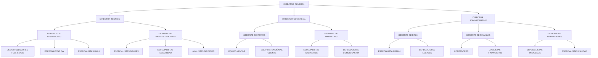
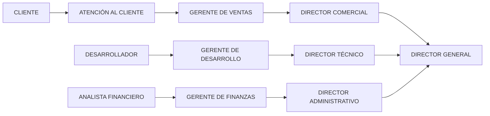

# ORGANIGRAMA VISUAL - BARRIOCONECTADO RD

## Diagrama de la Estructura Organizacional

## Descripción de Equipos por Área

### Área Técnica
- **Desarrolladores Full-Stack:** React/TypeScript, Node.js/Express
- **Especialistas QA:** Playwright, Jest, Testing automatizado
- **Especialistas UX/UI:** Diseño de interfaz, experiencia de usuario
- **Especialistas DevOps:** AWS, Docker, CI/CD
- **Especialistas Seguridad:** Ciberseguridad, compliance
- **Analistas de Datos:** Big Data, reportes, dashboards

### Área Comercial
- **Equipo Ventas:** Cierre de contratos, relaciones con clientes
- **Equipo Atención al Cliente:** Soporte técnico, capacitación
- **Especialistas Marketing:** Branding, comunicación digital
- **Especialistas Comunicación:** Relaciones públicas, eventos

### Área Administrativa
- **Especialistas RRHH:** Reclutamiento, desarrollo organizacional
- **Especialistas Legales:** Contratos, compliance, regulaciones
- **Contadores:** Contabilidad, facturación, impuestos
- **Analistas Financieros:** Presupuestos, proyecciones, inversiones
- **Especialistas Procesos:** Mejora continua, optimización
- **Especialistas Calidad:** ISO, auditorías, certificaciones

## Flujo de Comunicación

## Matriz de Responsabilidades

| Área | Responsabilidad Principal | Responsabilidad Secundaria |
|------|-------------------------|---------------------------|
| Técnica | Desarrollo del producto | Soporte técnico |
| Comercial | Ventas y marketing | Atención al cliente |
| Administrativa | Gestión interna | Compliance legal |
| General | Estrategia y dirección | Relaciones institucionales |